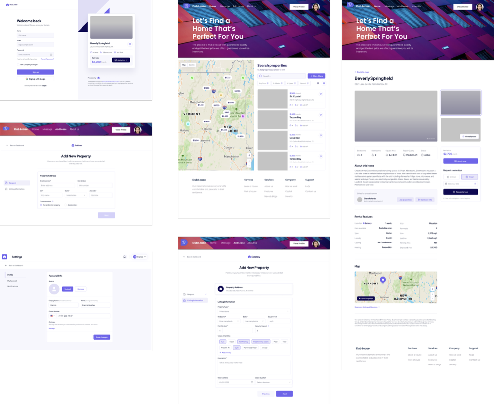

# DubLease

## Project Description
Most UW students decide to live near the school like the dorm, off-campus apartments and houses so that they can get on campus more conveniently. And depending on different leasing terms and personal needs, there are high demands of sublease throughout the year especially the summer. Currently, most of the related sublease information are posted on different social media like facebook and reddit, but they are not well organized and hard to use for UW students. Therefore, we propose the project of sublease web application, Dub Lease, that specifically targets UW students. With the Dub Lease, UW students can easily post and find the sublease that satisfies their needs.

**Team Members:**
| Name | Role | 
| --- | ----------- | 
| Ryan Li | Backend | 
| Lin Qiu | UI/UX Developer, Backend Developer | 
| Tony Song | PM, Frontend Developer |
| Carlos Yu | Testing + Backend Developer | 
| Crystal Li | UI + Backend Developer| 

## Features
1. User Info Management (Major)
  - Account login/signup
  - Edit personal information
  
2. Browsing subleasing (Major)
  - Filtering based on money / room type / apartment name
  - Searching available subleases based on apartment names
  - Viewing and selecting available subleases through an interactive map
  
3. Post/edit a sublease request (Major)
  - Allow subleasers to add photos / title / price / category / condition / description / sublease time / roommate /...
  
4. Posting history (Major)
5. Private messaging (Extend)
6. Apartment category (Extend)

**Documentation**

The more detailed development guide can be found in here [Developer Guideline](./DeveloperGuidelines.md).
For technical documentation, please refer to our Google documents regarding [Backend Routers](https://docs.google.com/document/d/1Q48TTSTBrOSXKS06upeNwzYLw0O1lRpGk2PCigNLAS8/edit?usp=sharing) .

## Repository Layout
* `server/`: contains all server-side backend code in NodeJS
  - set up the server via `npm start`
* `client/`: contains all client-side frontend code written in ReactJS
* `reports/`: contains all reports and writeups related to this project

